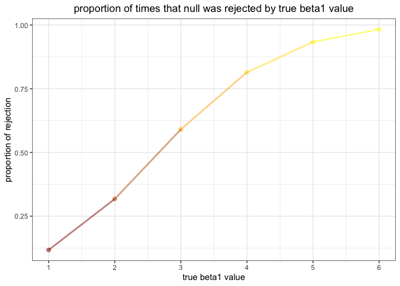

p8105\_hw5\_fj2269
================
Fangming Jin
2019/11/1

### Question 1

**1. import the data**

``` r
set.seed(10)
iris_with_missing = iris %>% 
  map_df(~replace(.x, sample(1:150, 20), NA)) %>%
  mutate(Species = as.character(Species))
iris_with_missing
```

    ## # A tibble: 150 x 5
    ##    Sepal.Length Sepal.Width Petal.Length Petal.Width Species
    ##           <dbl>       <dbl>        <dbl>       <dbl> <chr>  
    ##  1          5.1         3.5          1.4         0.2 setosa 
    ##  2          4.9         3            1.4         0.2 setosa 
    ##  3          4.7         3.2          1.3         0.2 setosa 
    ##  4          4.6         3.1          1.5        NA   setosa 
    ##  5          5           3.6          1.4         0.2 setosa 
    ##  6          5.4         3.9          1.7         0.4 setosa 
    ##  7         NA           3.4          1.4         0.3 setosa 
    ##  8          5           3.4          1.5         0.2 setosa 
    ##  9          4.4         2.9          1.4         0.2 setosa 
    ## 10          4.9         3.1         NA           0.1 setosa 
    ## # … with 140 more rows

**2. write the function and apply it to iris\_with\_missing**

The digit of the number I fill is same as number’s digit in dataset.

``` r
replace_function = function(x){
  
  if (is.numeric(x)) {
    y = round(mean(x, na.rm = TRUE),1)
    x = replace_na(x, y)
  } else if (is.character(x)) {
    x = replace_na(x, "virginica")
  }
  x
}
iris_with_missing = map_df(iris_with_missing, replace_function)
iris_with_missing
```

    ## # A tibble: 150 x 5
    ##    Sepal.Length Sepal.Width Petal.Length Petal.Width Species
    ##           <dbl>       <dbl>        <dbl>       <dbl> <chr>  
    ##  1          5.1         3.5          1.4         0.2 setosa 
    ##  2          4.9         3            1.4         0.2 setosa 
    ##  3          4.7         3.2          1.3         0.2 setosa 
    ##  4          4.6         3.1          1.5         1.2 setosa 
    ##  5          5           3.6          1.4         0.2 setosa 
    ##  6          5.4         3.9          1.7         0.4 setosa 
    ##  7          5.8         3.4          1.4         0.3 setosa 
    ##  8          5           3.4          1.5         0.2 setosa 
    ##  9          4.4         2.9          1.4         0.2 setosa 
    ## 10          4.9         3.1          3.8         0.1 setosa 
    ## # … with 140 more rows

### Question 2

**1. tidy the data**

``` r
readfile = function(x){
  y = str_c("./Q2/hw5_data/data/",x)
  z = read.csv(file = y) %>%
    mutate(name = x) %>%
    select(name, week_1:week_8)
  z
}
name = list.files('./Q2/hw5_data/data')
longitudinal = map_df(.x = name, ~readfile(.x)) %>%
  janitor::clean_names() %>%
  separate(name, c("arm", "ID"), sep = "([\\_\\.])") %>%
  mutate(arm = recode(arm, "con"="control","exp"="experimental")) %>%
  drop_na() 
longitudinal
```

    ##             arm ID week_1 week_2 week_3 week_4 week_5 week_6 week_7 week_8
    ## 1       control 01   0.20  -1.31   0.66   1.96   0.23   1.09   0.05   1.94
    ## 2       control 02   1.13  -0.88   1.07   0.17  -0.83  -0.31   1.58   0.44
    ## 3       control 03   1.77   3.11   2.22   3.26   3.31   0.89   1.88   1.01
    ## 4       control 04   1.04   3.66   1.22   2.33   1.47   2.70   1.87   1.66
    ## 5       control 05   0.47  -0.58  -0.09  -1.37  -0.32  -2.17   0.45   0.48
    ## 6       control 06   2.37   2.50   1.59  -0.16   2.08   3.07   0.78   2.35
    ## 7       control 07   0.03   1.21   1.13   0.64   0.49  -0.12  -0.07   0.46
    ## 8       control 08  -0.08   1.42   0.09   0.36   1.18  -1.16   0.33  -0.44
    ## 9       control 09   0.08   1.24   1.44   0.41   0.95   2.75   0.30   0.03
    ## 10      control 10   2.14   1.15   2.52   3.44   4.26   0.97   2.73  -0.53
    ## 11 experimental 01   3.05   3.67   4.84   5.80   6.33   5.46   6.38   5.91
    ## 12 experimental 02  -0.84   2.63   1.64   2.58   1.24   2.32   3.11   3.78
    ## 13 experimental 03   2.15   2.08   1.82   2.84   3.36   3.61   3.37   3.74
    ## 14 experimental 04  -0.62   2.54   3.78   2.73   4.49   5.82   6.00   6.49
    ## 15 experimental 05   0.70   3.33   5.34   5.57   6.90   6.66   6.24   6.95
    ## 16 experimental 06   3.73   4.08   5.40   6.41   4.87   6.09   7.66   5.83
    ## 17 experimental 07   1.18   2.35   1.23   1.17   2.02   1.61   3.13   4.88
    ## 18 experimental 08   1.37   1.43   1.84   3.60   3.80   4.72   4.68   5.70
    ## 19 experimental 09  -0.40   1.08   2.66   2.70   2.80   2.64   3.51   3.27
    ## 20 experimental 10   1.09   2.80   2.80   4.30   2.25   6.57   6.09   4.64

I also made a longer table:

``` r
longitudinal = longitudinal %>%
  pivot_longer( 
    week_1:week_8,
    names_to = "week", 
    values_to = "data",
    names_prefix = "week_") 
longitudinal
```

    ## # A tibble: 160 x 4
    ##    arm     ID    week   data
    ##    <chr>   <chr> <chr> <dbl>
    ##  1 control 01    1      0.2 
    ##  2 control 01    2     -1.31
    ##  3 control 01    3      0.66
    ##  4 control 01    4      1.96
    ##  5 control 01    5      0.23
    ##  6 control 01    6      1.09
    ##  7 control 01    7      0.05
    ##  8 control 01    8      1.94
    ##  9 control 02    1      1.13
    ## 10 control 02    2     -0.88
    ## # … with 150 more rows

**2. make spaghetti plot**

``` r
plot_spag = longitudinal %>% 
  ggplot(aes(x = week, y = data, group = ID, color = ID)) + 
    geom_line(size=0.5) + 
    facet_grid(~arm) +
    labs(title = "Observations on each subject in two groups over time", y = "longitudinal data") + 
    theme(plot.title = element_text(hjust = 0.5), legend.position = "right") +
    viridis::scale_color_viridis(discrete = TRUE) 
plot_spag
```

<!-- -->

The longitudinal data in control group does not change over time, and
longitudinal data in exprimental group increases significantly as time
passes. In first two weeks the longitudinal data in experimental group
is close to that in control group. But as time pass, the longitudinal
data in experimental group is significanty higher than that in control
group.

### Question 3

**1.simulation**

First we set up the model, simulate 10000 dataset when beta1 = 0

``` r
set.seed(14)
sim_regression = function(n = 30, beta0 = 2, beta1) {
  
  sim_data = tibble(
    x = rnorm(n, mean = 0, sd = 1),
    y = beta0 + beta1 * x + rnorm(n, 0, sqrt(50))
  )
  
  ls_fit = lm(y ~ x, data = sim_data)
  
  tibble(
    beta1_hat = coef(ls_fit)[2],
    beta1_p_value = pull(broom::tidy(ls_fit),p.value)[[2]]
  )
}
output_0 = rerun(10000, sim_regression(beta1 = 0)) %>% bind_rows()
```

repeat the above when beta1={1,2,3,4,5,6}

``` r
output = 
  tibble(beta1_true = c(1:6)) %>% 
  mutate(
    output_lists = map(.x = beta1_true, ~rerun(10000, sim_regression(beta1 = .x))),
    estimate_dfs = map(output_lists, bind_rows)) %>% 
  select(-output_lists) %>% 
  unnest(estimate_dfs)
```

**2.The relationship between effect size and power**

``` r
output %>%
  filter(beta1_p_value < 0.05) %>%
  group_by(beta1_true) %>%
  summarize(
    prop_reject = n()/10000
  ) %>%
  ggplot(aes(x = beta1_true, prop_reject, color = prop_reject)) +
    theme_bw() + 
    geom_point(size = 2, alpha = 0.5) +
    geom_line(size = 1, alpha = 0.5) +
    scale_color_gradientn(colors=c("darkred", "orange", "yellow")) +
    labs(title = "proportion of times that null was rejected by true beta1 value", x="true beta1 value", y="proportion of rejection") +
    theme(plot.title = element_text(hjust = 0.5),legend.position = "none") +
    scale_x_continuous(
    breaks = c(1,2,3,4,5,6), 
    labels = c(1,2,3,4,5,6)) 
```

<!-- -->

We already know β1 in H0 and H1:in H0, β1=0， in H1, β1 is equal to true
beta that we have already known(β1 = {1,2,3,4,5,6}).

Effect size is calculated by taking the difference between β in H0 and
H1.

Based on graph above, as true beta increases, effect size increases,
proportion of rejection increases. This means the proportion of
rejecting false null hypothesis increases as effect size increases,
power increases as effect size increases.

**3.**

``` r
mean_sum = output %>%
  group_by(beta1_true) %>%
  summarize(
    mean_beta1 = mean(beta1_hat)
  ) %>%
  mutate(group = rep("complete sample"))
mean_reject = output %>%
  filter(beta1_p_value < 0.05) %>%
  group_by(beta1_true) %>%
  summarize(
    mean_beta1 = mean(beta1_hat)
  ) %>%
  mutate(group = rep("sample that null is rejected"))
mean_beta1 = bind_rows(mean_reject, mean_sum) 
ggplot(mean_beta1, aes(x = beta1_true, y = mean_beta1, group = group, color = group)) +
  theme_bw() + 
  geom_point(size = 2, alpha = 0.5) +
  geom_line(size = 1) +
  labs(title = "average estimate of beta1 by true beta1 value", x="true beta1 value", y="average estimate of beta1") +
  viridis::scale_color_viridis(
    name = "sample scale", 
    discrete = TRUE
  ) +
  theme(plot.title = element_text(hjust = 0.5),legend.position = "bottom") +
  scale_x_continuous(
    breaks = c(1,2,3,4,5,6), 
    labels = c(1,2,3,4,5,6)) + 
  scale_y_continuous(
    breaks = c(1,2,3,4,5,6), 
    labels = c(1,2,3,4,5,6))
```

<!-- -->

According to graph above, the sample average of estimated β1 across
tests for complete sample is close to the true value of β1 no matter how
much true β1 is. The sample average of estimated β1 across tests for
which the null is rejected appraoch the true value of β1 as true value
of β1 is away from 0.

When β1 is closed to 0, the estimated β1 which is rejected is very
different from true value of β1. In this circumstance, mean estimated β1
across tests for which the null is rejected is far from true value of
β1.

When β1 is far away from 0, the estimated β1 has higher possibility to
be rejected. Estimated β1 that are closed to true β1 can be rejected.
This made mean estimated β1 across tests for which the null is rejected
closer to true value of β1.
